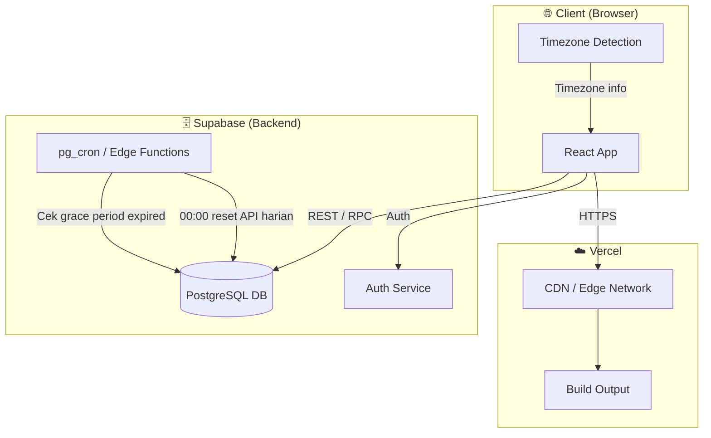
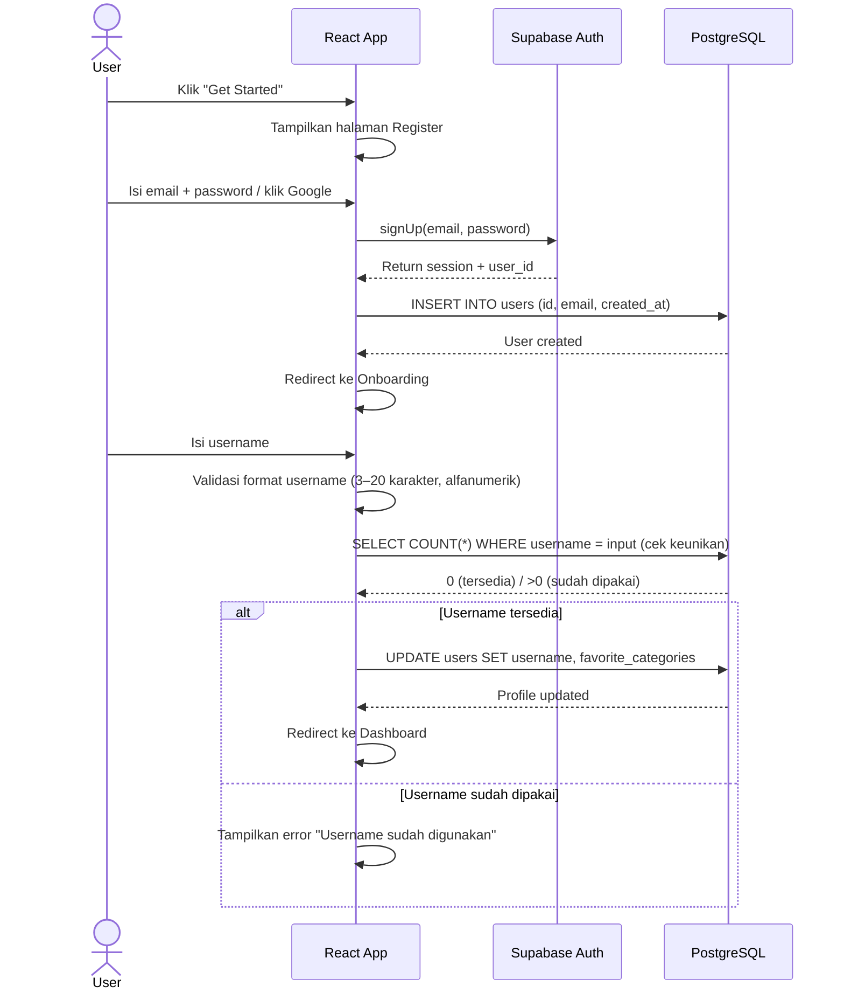
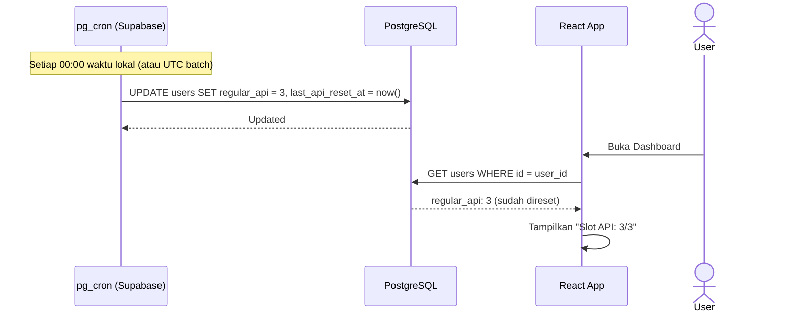
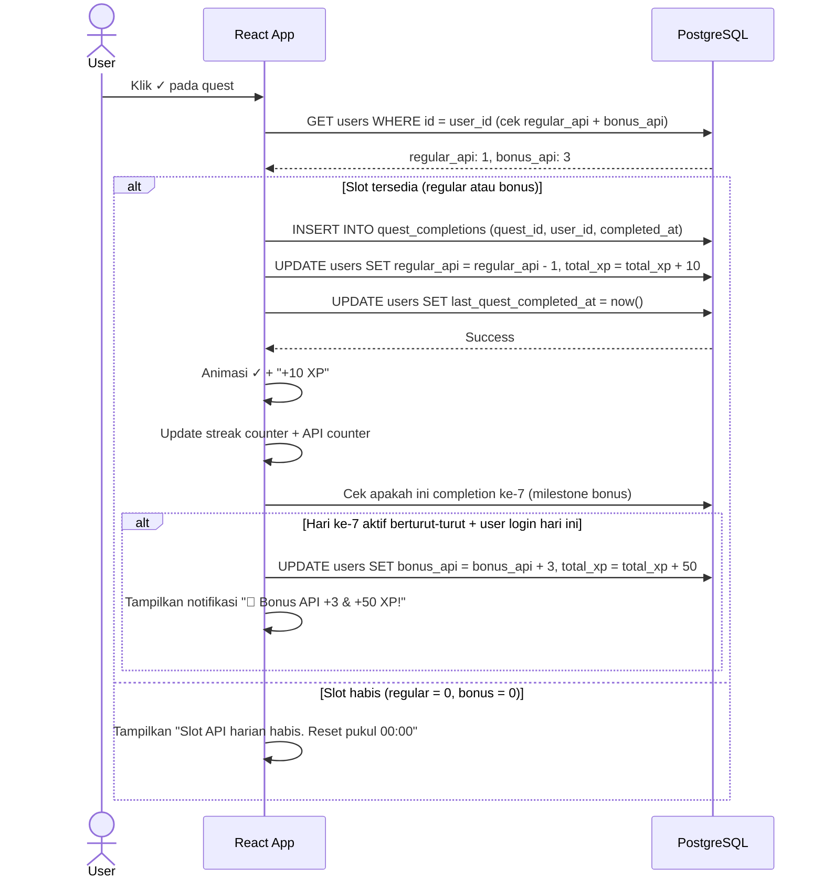
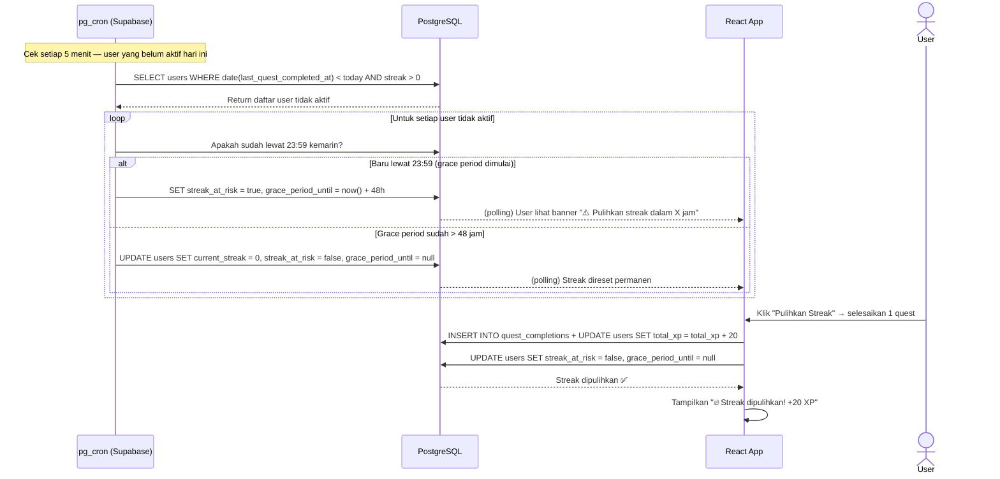
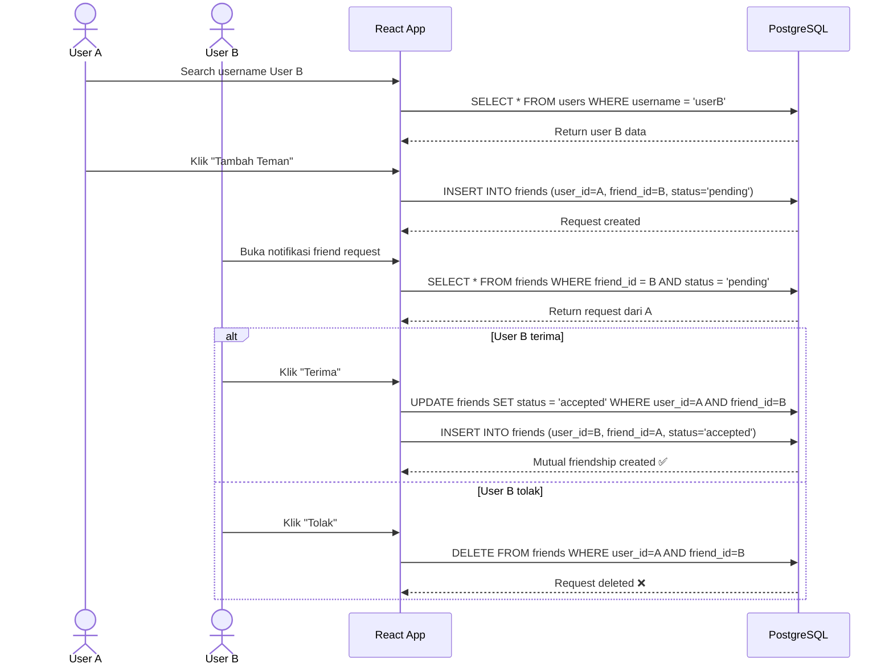
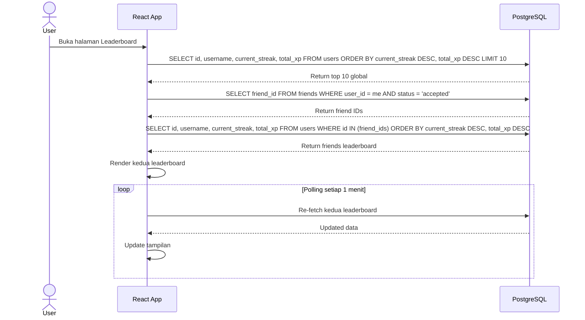
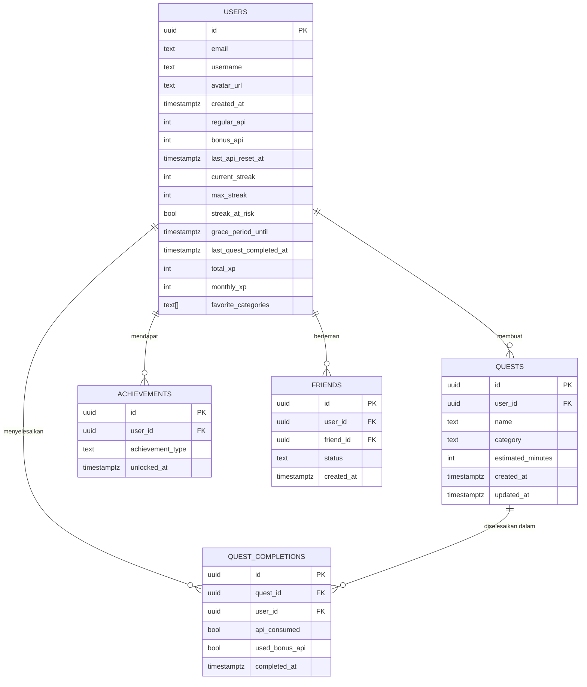
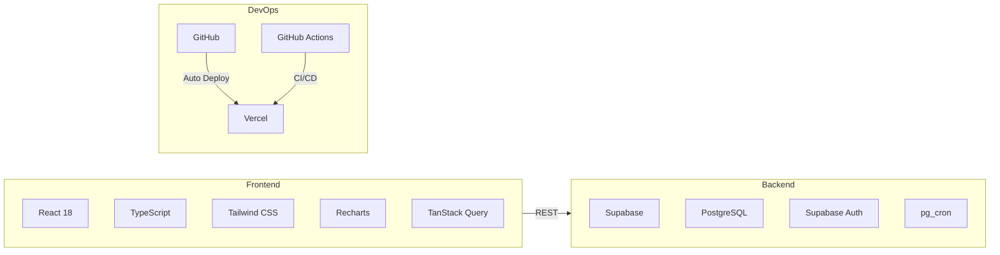

# 🔥 PRD — Streak App
**Daily Quest Tracker with Gamified API Mechanic**

| | |
|---|---|
| **Nama Project** | Streak |
| **Versi Dokumen** | v1.1 |
| **Tanggal** | 20 Juli 2026 |
| **Status** | Approved |
| **Kategori** | Productivity & Wellbeing untuk Mahasiswa Libur |

---

## Daftar Isi

1. [Overview](#1-overview)
2. [Requirements](#2-requirements)
3. [Core Features](#3-core-features)
4. [User Flow](#4-user-flow)
5. [Architecture](#5-architecture)
6. [Sequence Diagram](#6-sequence-diagram)
7. [Database Schema](#7-database-schema)
8. [Tech Stack](#8-tech-stack)
9. [Success Metrics](#9-success-metrics)
10. [MVP vs Roadmap](#10-mvp-vs-roadmap)

---

## 1. Overview

### 1.1 Deskripsi Singkat

Streak adalah web app daily quest tracker berbasis gamifikasi yang terinspirasi dari sistem streak TikTok. App ini dirancang khusus untuk mahasiswa yang sedang libur kuliah dan membutuhkan struktur harian agar tetap produktif tanpa merasa boring atau tertekan.

Bukan sekadar to-do list biasa — Streak menggunakan sistem **"API" (ikon api 🔥)** sebagai indikator konsistensi harian. Semakin banyak hari berturut-turut user menyelesaikan quest, semakin besar angka pada ikon api. Jika user melewatkan satu hari penuh, ikon api bisa padam — namun masih bisa dipulihkan dalam 48 jam sebelum benar-benar hilang.

### 1.2 Definisi Istilah Kunci

> Konsistensi istilah ini berlaku di seluruh dokumen dan codebase.

| Istilah | Definisi |
|---|---|
| **"Hari"** | Satu siklus kalender dari 00:00 hingga 23:59 waktu lokal user (timezone device) |
| **"Hari aktif"** | Hari di mana user menyelesaikan minimal 1 quest sebelum pukul 23:59 |
| **"Streak"** | Jumlah hari aktif berturut-turut tanpa jeda |
| **"API / Ikon Api 🔥"** | Indikator visual streak yang muncul setelah 3 hari aktif berturut-turut |
| **"API padam"** | Kondisi saat streak terputus karena tidak ada hari aktif dalam 1 hari kalender |
| **"Grace period"** | Periode pemulihan 48 jam setelah API padam sebelum streak dihapus permanen |

| **"Quest"** | Aktivitas yang dapat diselesaikan oleh user. Satu quest dapat diselesaikan berulang kali di hari berbeda |

### 1.3 User Persona & Masalah Utama

**Primary User: Mahasiswa Umum**

| Atribut | Detail |
|---|---|
| Status | Mahasiswa aktif, sedang libur kuliah panjang (2–4 bulan) |
| Behavior | Aktif di TikTok, familiar dengan streak mechanic, suka challenge ringan |
| Goals | Produktif selama libur, maintain habit, tidak merasa nganggur |
| Motivasi | Gamification, leaderboard, social comparison dengan teman |

**Masalah Utama:**

| Problem | Detail |
|---|---|
| Lack of Structure | Tidak ada deadline/jadwal → bingung mau ngapain tiap hari |
| Motivation Crash | Semangat hari pertama, bosan hari ketiga, give up setelah seminggu |
| No Accountability | Tidak ada yang follow-up, self-discipline rendah saat libur panjang |
| FOMO Sosial | Lihat teman sibuk/magang, merasa tertinggal, tidak tahu mulai darimana |
| Perfectionism Trap | Miss 1 hari → merasa "udah gagal" → give up total |

### 1.4 Value Proposition

> Ubah hari liburmu jadi game. Complete quest harian, jaga streak-mu tetap menyala, dan bersaing dengan teman — semua dalam satu app yang simple tapi addictive.

### 1.5 Goals Produk

- Memberikan struktur harian yang fleksibel tanpa rigid
- Mendorong konsistensi lewat streak mechanic yang addictive
- Mendorong konsistensi lewat streak mechanic yang addictive
- Membangun accountability lewat social leaderboard

---

## 2. Requirements

### 2.1 Functional Requirements

#### Autentikasi
- User dapat mendaftar dengan email atau Google
- User dapat login dan logout
- Session tetap aktif selama 30 hari
- Username wajib unik, 3–20 karakter, hanya huruf/angka/underscore, tidak boleh dimulai dengan angka

#### Quest Management
- User dapat membuat quest template (nama, kategori, estimasi waktu)
- Quest bersifat **reusable** — user dapat menyelesaikan quest yang sama di hari berbeda
- Setiap penyelesaian quest dicatat sebagai **quest completion log** (bukan mengubah status quest)
- Setiap penyelesaian quest dicatat sebagai **quest completion log** (bukan mengubah status quest)
- User dapat mengedit dan menghapus quest template
- User dapat melihat history completion per quest

#### Mekanisme & Ketentuan Streak (API)

**Syarat Muncul:**
- Ikon api 🔥 muncul setelah user berhasil menjadi **hari aktif selama 3 hari kalender berturut-turut**
- "Hari aktif" = menyelesaikan minimal 1 quest pada hari kalender tersebut (sebelum 23:59 waktu lokal)

**Cara Kerja Harian:**
- Setiap hari (00:00 waktu lokal), streak dicek apakah terpenuhi
- User harus menyelesaikan minimal 1 quest setiap hari agar streak terus bertambah
- Angka pada ikon api menunjukkan jumlah hari aktif berturut-turut

**API Padam:**
- Jika hingga 23:59 waktu lokal tidak ada quest yang diselesaikan, hari tersebut dianggap tidak aktif
- Streak terputus dan ikon api masuk ke status **"abu-abu" (pemulihan)**

**Pemulihan (Restore) — Grace Period 48 Jam:**
- Setelah API padam, user memiliki waktu **48 jam** untuk memulihkan streak
- Selama periode pemulihan, ikon api ditampilkan abu-abu dengan opsi "Pulihkan Streak"
- Untuk memulihkan: user harus menyelesaikan minimal 1 quest selama periode pemulihan
- Setelah 48 jam berlalu tanpa pemulihan → streak terhapus permanen, kembali ke 0
- Setelah streak dipulihkan, angka streak kembali seperti sebelum padam (tidak bertambah)


#### XP System
- Setiap completion quest memberikan **+10 XP**
- Menyelesaikan quest di hari ke-7 (milestone bonus) memberikan **+50 XP tambahan**
- Memulihkan streak (restore) memberikan **+20 XP**
- XP bersifat akumulatif dan tidak bisa berkurang
- XP digunakan untuk stats saja (tidak ada leveling atau unlock fitur)

#### Social & Leaderboard
- Relasi pertemanan bersifat **dua arah (mutual)**: user A mengirim request → user B menerima/menolak → jika diterima, keduanya menjadi teman
- User dapat mencari teman via username (unlimited)
- User dapat melihat profil teman (current streak, total XP, monthly XP)
- **Global Leaderboard:** top 10 user berdasarkan current streak, diperbarui setiap 1 menit via polling
- **Friends Leaderboard:** ranking di antara teman sendiri, diperbarui setiap 1 menit via polling
- Pilihan polling (bukan Realtime subscription) karena leaderboard tidak butuh push instan dan lebih hemat resource

#### Achievement
- Badge otomatis terbuka saat user mencapai milestone tertentu
- Satu user hanya bisa mendapat satu badge per tipe achievement (unique per user)
- Notifikasi muncul saat achievement baru terbuka

#### Error State & Validasi
- Username tidak valid: tampilkan pesan "Username hanya boleh huruf, angka, dan underscore (3–20 karakter)"
- Username sudah dipakai: tampilkan pesan "Username sudah digunakan, coba yang lain"

- Teman tidak ditemukan: tampilkan pesan "Username tidak ditemukan"
- Friend request sudah dikirim: tampilkan pesan "Permintaan pertemanan sudah dikirim"
- Koneksi gagal: tampilkan pesan "Gagal memuat data. Periksa koneksi kamu"

### 2.2 Non-Functional Requirements

| Aspek | Requirement |
|---|---|
| Performance | Halaman utama load < 2 detik |
| Responsiveness | Mobile-first, support layar 320px ke atas |
| Availability | Uptime 99% (memanfaatkan SLA Supabase + Vercel) |
| Security | Auth via Supabase Auth, RLS aktif di semua tabel |
| Scalability | Free tier cukup untuk 500 user aktif pertama (lihat estimasi di Seksi 8.4) |
| Browser Support | Chrome, Firefox, Safari (2 versi terakhir) |
| Timezone | Semua logika "hari" menggunakan timezone lokal device user; timestamp disimpan dalam UTC |

### 2.3 Constraints

- Seluruh infrastruktur menggunakan free tier (budget $0)
- Tidak ada fitur payment atau monetisasi di v1
- Tidak ada native mobile app (web app saja, responsive)
- Tidak ada fitur mood tracking / journaling

---

## 3. Core Features

### 3.1 Mekanisme Streak & API (Core Mechanic)

```
Hari 1–2  →  User mulai membuat quest dan menyelesaikannya
             (streak counter berjalan tapi ikon api belum muncul)

Hari ke-3 →  Setelah 3 hari aktif berturut-turut:
             Ikon api 🔥 muncul dengan angka "3"

Hari ke-4+ → Setiap hari aktif: angka bertambah 1
             Setiap 00:00: slot regular API direset ke 3

Hari ke-7  → Jika user login DAN menyelesaikan quest:
             Bonus +3 API + +50 XP milestone diberikan

Lewat 23:59 tanpa quest selesai:
             API padam → ikon abu-abu → grace period 48 jam

Dalam 48 jam (grace period):
             User selesaikan 1 quest → streak dipulihkan, angka kembali seperti sebelum padam

Setelah 48 jam tanpa pemulihan:
             Streak dihapus permanen → kembali ke 0
```

**Prioritas penggunaan slot:**
1. Regular API (3/hari, reset 00:00)
2. Bonus API (akumulatif, tidak direset)

### 3.2 Quest System (Reusable)

Quest adalah **template aktivitas** yang bisa diselesaikan berulang kali.

Kategori quest:
- 💻 Coding
- 🏃 Exercise
- 📚 Learning
- 🎮 Hobby
- 👥 Social
- 🏠 Chore

Contoh flow:
```
User membuat quest "Belajar React 30 menit" (kategori: Coding)
→ Senin: user klik ✓ → dicatat di completion log, -1 API, +10 XP
→ Selasa: user klik ✓ lagi → dicatat lagi di completion log, -1 API, +10 XP
→ Quest template tetap ada, tidak terhapus setelah diselesaikan
```

### 3.3 XP System

| Aksi | XP Diperoleh |
|---|---|
| Menyelesaikan 1 quest | +10 XP |
| Hari ke-7 milestone (login + complete) | +50 XP tambahan |
| Memulihkan streak (restore) | +20 XP |

XP hanya digunakan untuk stats dan leaderboard tiebreaker (jika streak sama, user dengan XP lebih tinggi di atas).

### 3.4 Social & Leaderboard

**Relasi Pertemanan (Dua Arah / Mutual):**
```
User A → kirim friend request ke User B
User B → terima atau tolak
Jika diterima → keduanya bisa saling lihat profil & masuk friends leaderboard
```

- **Global Leaderboard:** Top 10 user berdasarkan current streak (tiebreaker: total XP), polling setiap 1 menit
- **Friends Leaderboard:** Ranking di antara teman sendiri, polling setiap 1 menit
- Data leaderboard diambil langsung dari tabel `users` (tidak ada tabel terpisah) untuk menghindari duplikasi data

### 3.5 Achievement System

| Badge | Trigger | XP Bonus |
|---|---|---|
| 🔥 Week Warrior | 7-day streak | — |
| ⚡ Fortnight Fighter | 14-day streak | — |
| 🏆 Monthly Master | 30-day streak | — |
| ✅ Century Quester | 100 total quest completion | — |
| 💯 Quest Legend | 200 total quest completion | — |
| 🌟 Perfect Week | Hari aktif 7 hari berturut-turut (sama dengan Week Warrior, trigger bersamaan) | — |

> Catatan: badge "Week Warrior" dan "Perfect Week" keduanya trigger di hari ke-7 berturut-turut dan diberikan bersamaan. Tidak ada duplikasi — keduanya adalah badge berbeda yang unlock sekaligus.

---

## 4. User Flow

### 4.1 Daftar Halaman

| Halaman | Aksi yang Bisa Dilakukan User |
|---|---|
| **Homepage** | Baca penjelasan app, lihat preview mechanic, klik Get Started / Login |
| **Register / Login** | Daftar atau login dengan email atau Google |
| **Onboarding** | Isi username (dengan validasi), pilih kategori quest favorit, baca penjelasan mechanic |
| **Dashboard** | Lihat streak + status API, check-off quest, tambah quest, lihat summary bulan ini |
| **Quest Management** | Buat / edit / delete quest template, lihat completion history per quest |
| **Friends & Leaderboard** | Kirim/terima/tolak friend request, lihat global & friends leaderboard |
| **Profile** | Lihat stats, achievements, max streak, total XP, edit profil & akun |

### 4.2 Alur Utama

```
Homepage
  └─► klik "Get Started"
        └─► Register / Login
              └─► Onboarding (user baru)
                    └─► isi username (validasi) + pilih kategori favorit
                          └─► Dashboard
                                ├─► tambah quest → Quest Management
                                │     └─► isi nama, kategori, estimasi → simpan
                                │           └─► Dashboard
                                │                 └─► check-off quest
                                │                       └─► completion dicatat di log
                                │                             └─► -1 API, +10 XP
                                │                                   └─► streak terjaga
                                └─► klik Leaderboard → Friends & Leaderboard
                                      └─► lihat ranking global & teman
                                            └─► klik profil teman → Friend Profile
```

### 4.3 Alur Streak & Grace Period

```
00:00 waktu lokal
  └─► Slot regular API direset ke 3

Sepanjang hari (00:00–23:59)
  └─► User menyelesaikan quest → completion log dicatat → streak aman ✅

23:59 waktu lokal (tidak ada quest selesai hari ini)
  └─► Streak terputus → API masuk status "abu-abu"
        └─► Grace period 48 jam dimulai
              ├─► User selesaikan 1 quest dalam 48 jam
              │     └─► Streak dipulihkan ✅ (+20 XP restore)
              │           └─► Angka streak kembali seperti sebelum padam
              └─► 48 jam berlalu tanpa quest
                    └─► Streak dihapus permanen → kembali ke 0 ❌
```

### 4.4 Alur Friend Request (Dua Arah)

```
User A
  └─► Search username User B
        └─► Klik "Tambah Teman"
              └─► Status: "Permintaan Dikirim"
                    └─► User B menerima notifikasi
                          ├─► User B klik "Terima"
                          │     └─► Keduanya jadi teman mutual ✅
                          │           └─► Muncul di friends leaderboard masing-masing
                          └─► User B klik "Tolak"
                                └─► Request dihapus, tidak ada perubahan ❌
```

---

## 5. Architecture

### 5.1 High-Level Architecture



### 5.2 Component Architecture

```mermaid
graph LR
    subgraph Pages
        HP[Homepage]
        AUTH_P[Auth Page]
        OB[Onboarding]
        DASH[Dashboard]
        QM[Quest Management]
        LB[Leaderboard]
        PROF[Profile]
    end

    subgraph Components
        STREAK_C[StreakCounter]
        API_C[APIStatusBar]
        QUEST_C[QuestCard]
        LEADER_C[LeaderboardCard]
        ACHIEVE_C[AchievementBadge]
        RESTORE_C[StreakRestoreBanner]
        ERR_C[ErrorState]
    end

    subgraph Hooks
        useAuth
        useStreak
        useAPI
        useQuests
        useFriends
        useLeaderboard
        useTimezone
    end

    subgraph Services
        authService
        questService
        streakService
        apiService
        socialService
        xpService
    end

    Pages --> Components
    Components --> Hooks
    Hooks --> Services
    Services -->|Supabase Client| DB[(Supabase DB)]
```



---

## 6. Sequence Diagram

### 6.1 Alur Register & Onboarding



### 6.2 Alur Reset API Harian (00:00)



### 6.3 Alur Check-off Quest



### 6.4 Alur Grace Period & Pemulihan Streak



### 6.5 Alur Friend Request (Dua Arah)



### 6.6 Alur Leaderboard (Polling)



---

## 7. Database Schema

### 7.1 Entity Relationship Diagram



> Catatan: Tabel `leaderboard` dihapus. Data leaderboard diambil langsung dari tabel `users` (kolom `current_streak`, `total_xp`) untuk menghindari duplikasi dan potensi data tidak sinkron.

### 7.2 SQL Table Definitions

```sql
-- Users
CREATE TABLE users (
  id                      UUID PRIMARY KEY DEFAULT gen_random_uuid(),
  email                   TEXT UNIQUE NOT NULL,
  username                TEXT UNIQUE CHECK (username ~ '^[a-zA-Z][a-zA-Z0-9_]{2,19}$'),
  avatar_url              TEXT,
  created_at              TIMESTAMPTZ DEFAULT now(),

  -- API System
  regular_api             INT DEFAULT 3 CHECK (regular_api >= 0),
  bonus_api               INT DEFAULT 0 CHECK (bonus_api >= 0),
  last_api_reset_at       TIMESTAMPTZ,

  -- Streak System
  current_streak          INT DEFAULT 0 CHECK (current_streak >= 0),
  max_streak              INT DEFAULT 0 CHECK (max_streak >= 0),
  streak_at_risk          BOOLEAN DEFAULT false,
  grace_period_until      TIMESTAMPTZ,
  last_quest_completed_at TIMESTAMPTZ,

  -- Progression
  total_xp                INT DEFAULT 0 CHECK (total_xp >= 0),
  monthly_xp              INT DEFAULT 0 CHECK (monthly_xp >= 0),
  favorite_categories     TEXT[] DEFAULT '{}'
);

-- Quest Templates (reusable)
CREATE TABLE quests (
  id                UUID PRIMARY KEY DEFAULT gen_random_uuid(),
  user_id           UUID REFERENCES users(id) ON DELETE CASCADE,
  name              TEXT NOT NULL,
  category          TEXT NOT NULL CHECK (category IN ('coding','exercise','learning','hobby','social','chore')),
  estimated_minutes INT CHECK (estimated_minutes > 0),
  created_at        TIMESTAMPTZ DEFAULT now(),
  updated_at        TIMESTAMPTZ DEFAULT now()
);

-- Quest Completion Log (satu baris per penyelesaian)
CREATE TABLE quest_completions (
  id              UUID PRIMARY KEY DEFAULT gen_random_uuid(),
  quest_id        UUID REFERENCES quests(id) ON DELETE CASCADE,
  user_id         UUID REFERENCES users(id) ON DELETE CASCADE,
  api_consumed    BOOLEAN DEFAULT true,
  used_bonus_api  BOOLEAN DEFAULT false,
  completed_at    TIMESTAMPTZ DEFAULT now()
);

-- Achievements
CREATE TABLE achievements (
  id               UUID PRIMARY KEY DEFAULT gen_random_uuid(),
  user_id          UUID REFERENCES users(id) ON DELETE CASCADE,
  achievement_type TEXT NOT NULL,
  unlocked_at      TIMESTAMPTZ DEFAULT now(),
  UNIQUE(user_id, achievement_type)
);

-- Friends (mutual: setiap relasi dua arah disimpan dua baris)
CREATE TABLE friends (
  id         UUID PRIMARY KEY DEFAULT gen_random_uuid(),
  user_id    UUID REFERENCES users(id) ON DELETE CASCADE,
  friend_id  UUID REFERENCES users(id) ON DELETE CASCADE,
  status     TEXT DEFAULT 'pending' CHECK (status IN ('pending','accepted','blocked')),
  created_at TIMESTAMPTZ DEFAULT now(),
  UNIQUE(user_id, friend_id)
);

-- Index untuk performa query leaderboard
CREATE INDEX idx_users_streak ON users(current_streak DESC, total_xp DESC);
CREATE INDEX idx_quest_completions_user ON quest_completions(user_id, completed_at DESC);
CREATE INDEX idx_friends_lookup ON friends(user_id, status);
```

### 7.3 Row Level Security (RLS)

```sql
-- Users: baca data sendiri + data publik teman (username, streak, xp)
ALTER TABLE users ENABLE ROW LEVEL SECURITY;
CREATE POLICY "user read own" ON users FOR SELECT USING (auth.uid() = id);
CREATE POLICY "user update own" ON users FOR UPDATE USING (auth.uid() = id);
CREATE POLICY "public profile read" ON users FOR SELECT
  USING (username IS NOT NULL); -- untuk leaderboard & friend search

-- Quests: hanya pemilik yang bisa akses
ALTER TABLE quests ENABLE ROW LEVEL SECURITY;
CREATE POLICY "user manage own quests" ON quests FOR ALL USING (auth.uid() = user_id);

-- Quest Completions: hanya pemilik
ALTER TABLE quest_completions ENABLE ROW LEVEL SECURITY;
CREATE POLICY "user manage own completions" ON quest_completions FOR ALL
  USING (auth.uid() = user_id);

-- Achievements: hanya pemilik
ALTER TABLE achievements ENABLE ROW LEVEL SECURITY;
CREATE POLICY "user read own achievements" ON achievements FOR SELECT
  USING (auth.uid() = user_id);

-- Friends: bisa akses relasi yang melibatkan diri sendiri
ALTER TABLE friends ENABLE ROW LEVEL SECURITY;
CREATE POLICY "user manage own friends" ON friends FOR ALL
  USING (auth.uid() = user_id OR auth.uid() = friend_id);
```

---

## 8. Tech Stack

### 8.1 Overview



### 8.2 Detail Tech Stack

| Layer | Teknologi | Alasan Dipilih |
|---|---|---|
| **Frontend Framework** | React 18 + TypeScript | Ekosistem besar, cocok untuk vibe coding dengan AI |
| **Styling** | Tailwind CSS | Utility-first, mobile-first friendly, cepat dipakai |
| **State & Data Fetching** | TanStack Query | Polling interval built-in, caching otomatis, cocok untuk leaderboard |
| **Charts** | Recharts | Ringan, React-native, open source |
| **Database** | Supabase (PostgreSQL) | SQL cocok untuk relasi kompleks (friends, completions log), free tier cukup |
| **Auth** | Supabase Auth | Built-in dengan DB, support Google OAuth |
| **Cron Jobs** | pg_cron (Supabase) | Reset API 00:00 & cek grace period langsung di database layer |
| **Deploy** | Vercel | Auto-deploy dari GitHub, CDN global, free tier cukup |
| **Version Control** | GitHub | Integrasi langsung dengan Vercel |
| **CI/CD** | GitHub Actions | Auto lint + build check sebelum merge ke main |

### 8.3 Kenapa Supabase (bukan Firebase)?

| Aspek | Supabase ✅ | Firebase ❌ |
|---|---|---|
| **Query kompleks** | SQL penuh → leaderboard, friends, completion log fleksibel | NoSQL → query relasional butuh workaround |
| **Relasi data** | Foreign key, JOIN, RLS built-in | Manual di application layer |
| **Cron Jobs** | pg_cron built-in | Butuh Cloud Functions (lebih kompleks) |
| **Open Source** | ✅ Ya | ❌ Tidak |
| **Dev Experience** | SQL familiar, mudah di-debug | Firestore syntax berbeda |

### 8.4 Estimasi Penggunaan Free Tier

> Asumsi: 500 user aktif, rata-rata 5 quest completion/user/hari, polling leaderboard setiap 1 menit.

| Resource | Limit Free | Estimasi (500 user) | Status |
|---|---|---|---|
| Database storage | 500MB | ~80MB (log + users) | ✅ Aman |
| Auth MAU | 50.000 | 500 user | ✅ Aman |
| DB requests/hari | ~500k (estimasi) | ~150k/hari | ✅ Aman |
| Edge Function invocations | 500k/bulan | ~50k/bulan (cron) | ✅ Aman |
| Vercel bandwidth | 100GB/bulan | ~5GB/bulan | ✅ Aman |

---

## 9. Success Metrics

### 9.1 Teknis (Launch Criteria)

- [ ] App live dan dapat diakses via URL publik (Vercel)
- [ ] Fitur MVP berjalan tanpa critical bug (lihat Seksi 10)
- [ ] Mobile-responsive, dapat digunakan di layar 320px ke atas
- [ ] Onboarding flow selesai dalam < 2 menit untuk user baru
- [ ] Dokumentasi teknis dan user guide tersedia

### 9.2 Product (Post-Launch, 2 Minggu Pertama)

| Metric | Target |
|---|---|
| User terdaftar | ≥ 10 user nyata (bukan dummy) |
| Streak ≥ 3 hari | ≥ 5 user berhasil unlock ikon api |
| Quest completion | ≥ 50 total completions |
| Grace period digunakan | ≥ 1 user berhasil restore streak |
| Zero critical bug | Tidak ada bug yang membuat core flow tidak bisa dijalankan |

---

## 10. MVP vs Roadmap

### 10.1 MVP (Harus Selesai Sebelum Launch)

| Fitur | Prioritas |
|---|---|
| Register / Login (email + Google) | 🔴 Wajib |
| Onboarding + validasi username | 🔴 Wajib |
| Quest template CRUD | 🔴 Wajib |
| Quest completion log | 🔴 Wajib |
| API slot harian (regular, 3/hari, reset 00:00) | 🔴 Wajib |
| Streak tracking (hari aktif berturut-turut) | 🔴 Wajib |
| Ikon api muncul setelah 3 hari aktif | 🔴 Wajib |
| Grace period 48 jam + restore | 🔴 Wajib |
| Bonus API hari ke-7 | 🔴 Wajib |
| XP system (basic) | 🔴 Wajib |
| Achievement badges | 🟡 Penting |
| Friend request (dua arah) | 🟡 Penting |
| Global Leaderboard (polling) | 🟡 Penting |
| Friends Leaderboard | 🟡 Penting |
| Profile page | 🟡 Penting |
| Error states & validasi form | 🔴 Wajib |
| Mobile-responsive UI | 🔴 Wajib |

### 10.2 Roadmap (Setelah Launch / Refinement Phase)

| Fitur | Keterangan |
|---|---|
| Push notification (streak reminder) | Notif saat mendekati akhir hari tanpa quest |
| Weekly recap | Ringkasan aktivitas mingguan via email |
| Quest suggestion | Rekomendasi quest berdasarkan kategori favorit |
| Streak leaderboard history | Lihat perkembangan streak dari waktu ke waktu |
| Dark mode | Preferensi tampilan |
| Share streak ke media sosial | Export gambar streak untuk di-share ke TikTok/IG |

---

*PRD ini dibuat sebagai bagian dari Campaign Vibe Coding Intern — Juli 2026 | v1.1*
